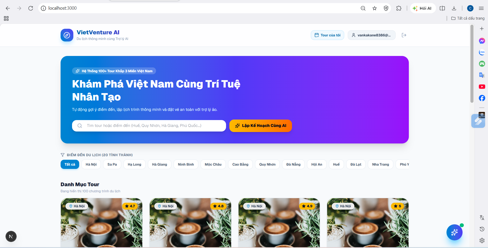
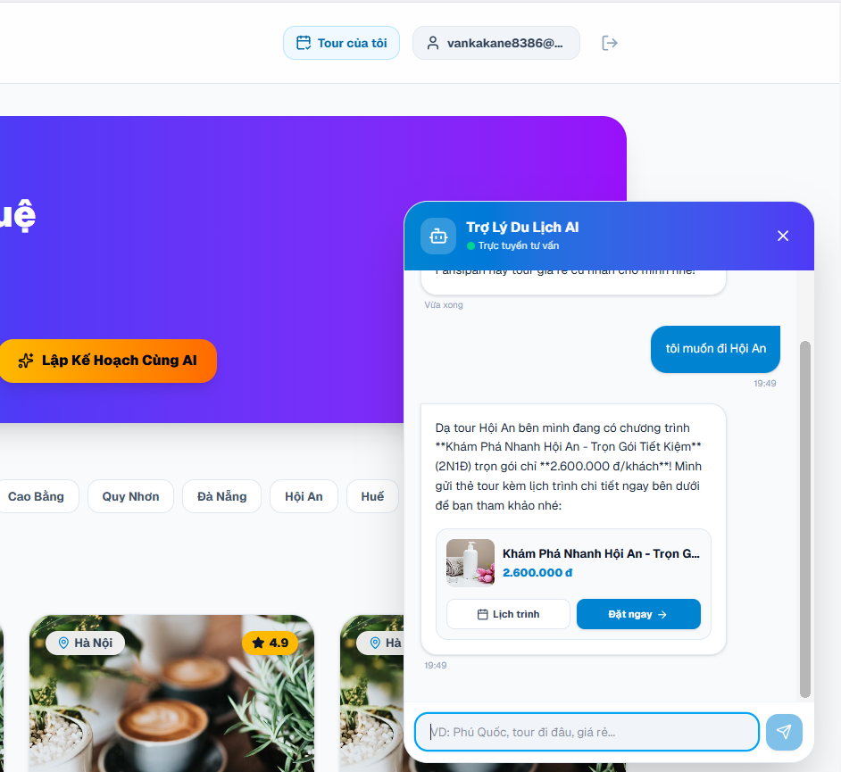
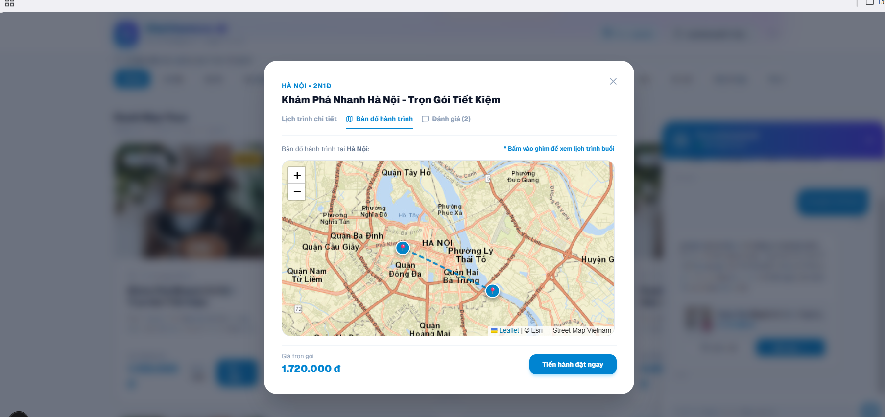
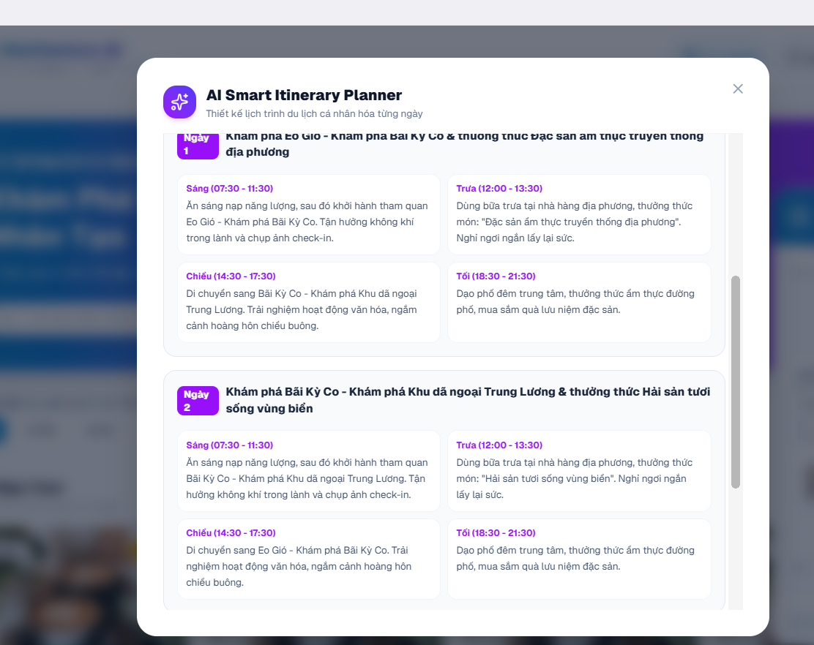
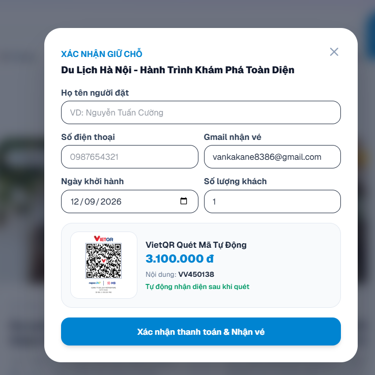
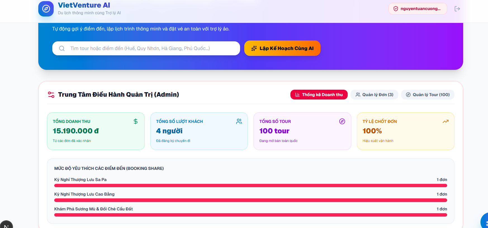

# ✈️ VietVenture AI - Hệ Thống Đặt Tour Du Lịch Việt Nam Tích Hợp Chatbot & Lập Lịch Trình Thông Minh

> Nền tảng thương mại điện tử du lịch thế hệ mới với danh mục hơn 100 tour khắp 3 miền Việt Nam, trợ lý ảo AI tư vấn ngữ cảnh địa lý, công cụ tự sinh lịch trình cá nhân hóa, bản đồ tương tác OpenStreetMap/Leaflet và thanh toán mã VietQR tự động.

---

## 📸 Demo & Giao Diện Hệ Thống

| 1. Trang Chủ & Danh Mục 100+ Tour | 2. Trợ Lý AI Tư Vấn & Thẻ Tour |
| :---: | :---: |
|  |  |

| 3. Bản Đồ Hành Trình Tương Tác (Leaflet) | 4. AI Smart Itinerary Planner |
| :---: | :---: |
|  |  |

| 5. Thanh Toán VietQR Tự Động | 6. Bảng Phân Tích Doanh Thu Admin |
| :---: | :---: |
|  |  |

---

## 🚀 Tính Năng Nổi Bật

### 1. Dành cho Khách Hàng (Customer Experience)

- **Kho dữ liệu 100+ Tour đa dạng**: Phủ sóng 20+ tỉnh thành lớn khắp cả nước (Hà Giang, Sa Pa, Hạ Long, Ninh Bình, Huế, Đà Nẵng, Hội An, Quy Nhơn, Phú Yên, Đà Lạt, Phú Quốc, Côn Đảo...).

- **Trợ lý AI Trực tuyến (Context-Aware Chatbot)**:
  - Tích hợp cơ chế RAG (Retrieval-Augmented Generation) tìm kiếm dữ liệu tour thời gian thực.
  - Hiểu câu hỏi nối tiếp và liên kết địa phương lân cận (ví dụ: đang xem Quy Nhơn hỏi "gần đó có gì" sẽ tự động tư vấn Phú Yên, Nha Trang).
  - Đính kèm thẻ Tour tương tác trực tiếp ngay trong bong bóng chat.

- **AI Smart Itinerary Planner**: Tự động sinh lịch trình du lịch chi tiết từng ngày (Sáng, Trưa, Chiều, Tối kèm đặc sản địa phương) dựa trên ngân sách và sở thích.

- **Bản đồ số hóa hành trình (Leaflet GIS)**: Trực quan hóa tọa độ các điểm dừng chân, vẽ tuyến đường di chuyển từng ngày trên nền bản đồ địa hình sắc nét.

- **Đánh giá & AI Phân tích cảm nhận**: Tự động tổng hợp điểm cộng, điểm trừ và lời khuyên từ các bình luận thực tế của du khách.

- **Thanh toán VietQR & Hóa đơn tự động**: Tự động tạo mã VietQR chuẩn ngân hàng (MB Bank) kèm số tiền, mã vé và tự động bắn email xác nhận về Gmail.

### 2. Dành cho Quản Trị Viên (Admin Center)

- **Bảng điều khiển Analytics & KPIs**: Thống kê doanh thu thực tế, tổng lượng khách, tỷ lệ chốt đơn và biểu đồ cột tỷ trọng đặt tour theo từng điểm đến.

- **Quản trị đơn đặt chỗ**: Theo dõi toàn bộ booking trên hệ thống, duyệt vé hoặc hủy đơn linh hoạt.

- **CRUD Tour tuyến**: Thêm tour mới, điều chỉnh giá, thời lượng và gỡ bỏ tour nhanh chóng.

- **Phân quyền người dùng (RBAC)**: Bảo vệ luồng quản trị, phân tách quyền giữa Khách hàng và Admin qua hệ thống xác thực.

---

## 🛠 Kiến Trúc Công Nghệ (Tech Stack)

- **Framework**: Next.js 14+ (App Router, Server Actions, API Routes)
- **Ngôn ngữ**: TypeScript
- **Trí tuệ nhân tạo (AI Engine)**: Google Gemini API (Gemini 2.5 Flash) kết hợp Local Semantic RAG Fallback
- **Giao diện & Styling**: Tailwind CSS, Lucide React (Icons)
- **Bản đồ số (GIS)**: Leaflet, React-Leaflet, Esri World Street Map Tiles
- **Dịch vụ Email**: Nodemailer (Tích hợp Google App Password SMTP)
- **Cổng thanh toán**: VietQR Open API
- **Quản lý trạng thái & Bộ nhớ**: React Hooks, LocalStorage Cache

---

## 💻 Hướng Dẫn Cài Đặt & Chạy Cục Bộ (Local Setup)

### 1. Clone mã nguồn về máy

```bash
git clone https://github.com/<tai-khoan-cua-ban>/travel-booking-ai.git
cd travel-booking-ai
```

### 2. Cài đặt thư viện phụ thuộc

```bash
npm install
```

### 3. Cấu hình biến môi trường

Tạo file `.env.local` tại thư mục gốc dự án:

```env
# API Key Trí tuệ nhân tạo (Lấy tại Google AI Studio)
GEMINI_API_KEY=your_gemini_api_key_here

# Cấu hình SMTP gửi mail hóa đơn tự động
EMAIL_USER=your_email@gmail.com
EMAIL_PASS=your_gmail_app_password_16_chars
```

### 4. Khởi chạy ứng dụng

```bash
npm run dev
```

Mở trình duyệt và truy cập:

```text
http://localhost:3000
```

---

## 🔐 Tài Khoản Trải Nghiệm Mặc Định

### Quyền Quản Trị Viên (Admin)

- **Email**: `admin@gmail.com`
- **Mật khẩu**: `admin123`

### Quyền Khách Hàng (Customer)

- Sử dụng tính năng **Đăng ký** để nhận mã OTP 6 số gửi thẳng về hòm thư cá nhân.

---

## 📂 Cấu Trúc Thư Mục Screenshots

Đảm bảo các ảnh demo được đặt đúng vị trí:

```text
public/
└── screenshots/
    ├── home.png
    ├── chatbot.png
    ├── map.png
    ├── planner.png
    ├── qr_invoice.png
    └── admin.png
```

---

## ✈️ VietVenture AI

> Nền tảng đặt tour du lịch Việt Nam tích hợp trí tuệ nhân tạo, bản đồ số và thanh toán VietQR, mang đến trải nghiệm tìm kiếm, tư vấn, lập lịch trình và đặt tour trực tuyến trên một hệ thống duy nhất.